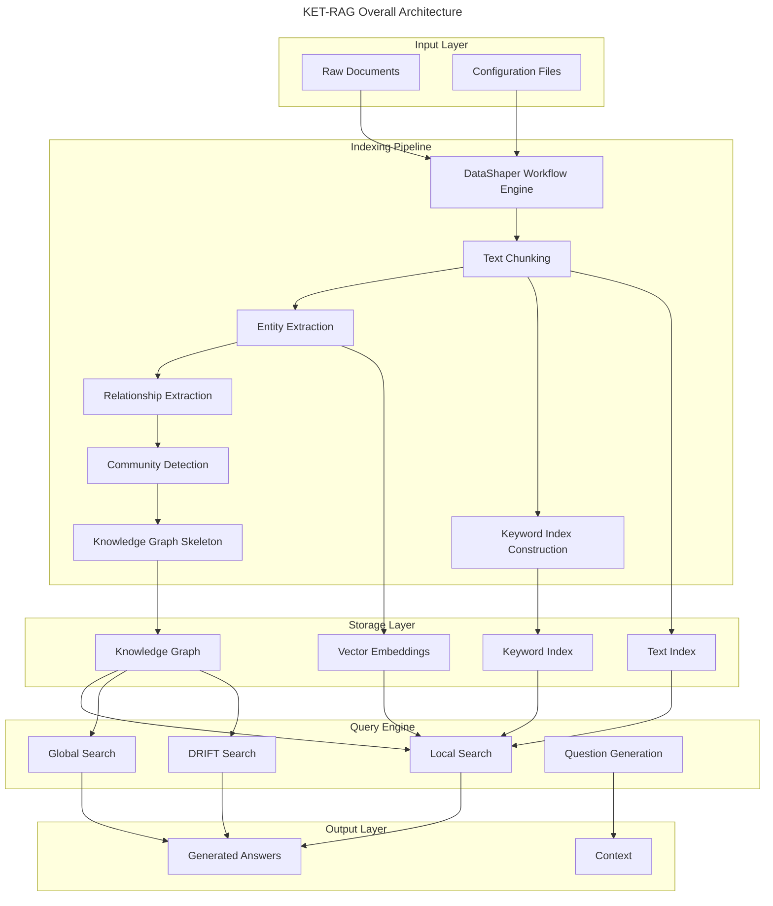
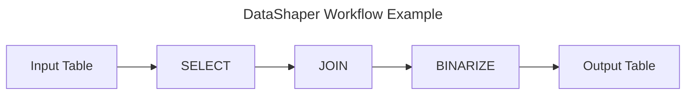
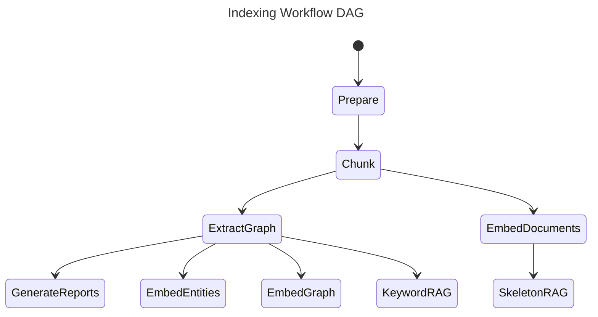

# KET-RAG Project Architecture

## Project Overview

**KET-RAG (Knowledge-Enhanced Text Retrieval Augmented Generation)** is a powerful and flexible framework for retrieval-augmented generation (RAG) enhanced with knowledge graphs. This project enables structured document indexing and efficient LLM-based answer generation.

KET-RAG balances retrieval quality and efficiency through a multi-granular indexing framework consisting of two core innovation components:

### Core Innovation Components

1. **Knowledge Graph Skeleton (SkeletonRAG)**
   - Selects key text chunks via PageRank algorithm
   - Extracts structured knowledge using LLMs
   - Builds high-quality knowledge graph skeleton

2. **Text-Keyword Bipartite Graph (KeywordRAG)**
   - Links keywords to text chunks
   - Mimics knowledge graph relationships with minimal cost
   - Provides lightweight retrieval indexing

## Overall Architecture

KET-RAG is built upon Microsoft GraphRAG and consists of two core modules:

### 1. Indexing Pipeline
Responsible for processing raw documents into structured knowledge representations

### 2. Query Engine
Responsible for retrieval and answer generation based on indexed data



## Detailed Architecture Components

### I. Indexing Pipeline

#### 1.1 DataShaper Workflow Engine
- **Foundation**: Built on Microsoft DataShaper library
- **Workflow Model**: Declarative data pipeline expression
- **Verb System**: Uses relational operation verbs like SELECT, DROP, JOIN
- **Data Flow**: Table-based data passing using pandas.DataFrame



#### 1.2 LLM-Enhanced Workflow Steps
- **Entity Extraction**: Extract named entities from text using LLMs
- **Relationship Extraction**: Identify semantic relationships between entities
- **Claim Extraction**: Extract key claims and assertions from documents
- **Community Structure**: Detect community structures in knowledge graphs
- **Community Reports**: Generate community summaries and reports

#### 1.3 Workflow Dependency Graph (DAG)


#### 1.4 KET-RAG Specific Components

##### SkeletonRAG (Knowledge Graph Skeleton)
- **Objective**: Build high-quality knowledge graph skeleton
- **Methods**: 
  - Use PageRank algorithm to select important text chunks
  - Extract structured knowledge through LLMs
  - Construct entity-relationship networks
- **Output**: Refined knowledge graph structure

##### KeywordRAG (Keyword Index)
- **Objective**: Establish lightweight text-keyword mapping
- **Methods**:
  - Extract document keywords
  - Build keyword-to-text-chunk bipartite graph
  - Filter stopwords and punctuation
- **Output**: Keyword index and mapping relationships

### II. Query Engine

#### 2.1 Local Search
- **Principle**: Generate answers by combining knowledge graph with raw text chunks
- **Use Cases**: Questions requiring understanding of specific entities in documents
- **Example**: "What are the healing properties of chamomile?"

#### 2.2 Global Search
- **Principle**: Search all AI-generated community reports in map-reduce fashion
- **Use Cases**: Questions requiring understanding of the entire dataset
- **Characteristics**: Resource-intensive but high-quality answers
- **Example**: "What are the most significant values of herbs mentioned in this notebook?"

#### 2.3 DRIFT Search
- **Innovation**: Include community information in the search process
- **Advantages**: Expand query starting point breadth, retrieve more diverse facts
- **Method**: Use community insights to refine queries into detailed follow-up questions

#### 2.4 Question Generation
- **Function**: Generate follow-up candidate questions based on user queries
- **Applications**: Conversational follow-up question generation, deep dataset exploration

### III. Storage Architecture

#### 3.1 Storage Abstraction Layer
```python
# Support multiple storage backends
PipelineStorage
├── FilePipelineStorage      # File system storage
├── BlobPipelineStorage      # Cloud storage (Azure Blob)
└── MemoryPipelineStorage    # In-memory storage
```

#### 3.2 Caching Mechanism
```python
# Multi-level caching system
PipelineCache
├── JsonPipelineCache        # JSON file cache
├── InMemoryCache           # In-memory cache
└── NoopPipelineCache       # No cache mode
```

#### 3.3 Data Models

##### Core Entities
- **Document**: Raw documents
- **TextUnit**: Text chunks/segments
- **Entity**: Extracted entities
- **Relationship**: Entity relationships
- **Community**: Community structures
- **CommunityReport**: Community reports
- **Covariate**: Covariates

### IV. Configuration System

#### 4.1 Pipeline Configuration
```yaml
# settings.yaml example
encoding_model: "cl100k_base"
skip_workflows: []
local_search:
  text_unit_prop: 0.5
  community_prop: 0.1
  conversation_history_max_turns: 5
global_search:
  max_tokens: 12000
  data_max_tokens: 12000
```

#### 4.2 Workflow Configuration
- **Input Configuration**: CSV/text file input
- **Storage Configuration**: File/Blob/memory storage
- **Cache Configuration**: Multi-level caching strategies
- **Reporting Configuration**: Console/file/blob reporting

### V. KET-RAG Specific Workflows

#### 5.1 Context Generation Workflow
```bash
python indexing_sket/create_context.py ragtest-musique/ keyword 0.5
```

**Parameter Description**:
- **First argument**: Project root directory
- **Second argument**: Context building strategy (`text`, `keyword`, `skeleton`)
- **Third argument**: Context threshold theta (range: 0.0-1.0)

#### 5.2 Answer Generation Workflow
```bash
python indexing_sket/llm_answer.py ragtest-musique/
```

**Function**: Generate answers for all context files in the output directory

### VI. Technology Stack

#### 6.1 Core Dependencies
- **Python**: >=3.10
- **DataShaper**: Data processing pipeline
- **OpenAI**: LLM API interface
- **pandas**: DataFrame processing
- **numpy**: Numerical computation
- **faiss**: Vector similarity search
- **lancedb**: Vector database
- **tiktoken**: Text tokenization

#### 6.2 Vector Stores
- **Azure Search Documents**: Azure Cognitive Search
- **LanceDB**: Vector database
- **FAISS**: Facebook vector similarity search

### VII. Deployment and Usage

#### 7.1 Project Initialization
```bash
python -m graphrag init --root ragtest-musique/
```

#### 7.2 Prompt Tuning
```bash
python -m graphrag prompt-tune --root ragtest-musique/ --config ragtest-musique/settings.yaml --discover-entity-types
```

#### 7.3 Index Building
```bash
python -m graphrag index --root ragtest-musique/
```

### VIII. Performance Characteristics

#### 8.1 KET-RAG Advantages
- **Cost Efficiency**: Significantly reduce indexing costs
- **Retrieval Quality**: Improve retrieval and generation quality
- **Scalability**: Suitable for large-scale RAG applications
- **Flexibility**: Support multiple retrieval strategies

#### 8.2 Multi-granular Indexing
- **Coarse-grained**: SkeletonRAG provides high-quality skeleton
- **Fine-grained**: KeywordRAG provides detailed mapping
- **Adaptive**: Select optimal strategy based on query type

## Summary

KET-RAG achieves significant cost reduction while maintaining retrieval quality through its innovative dual indexing strategy (SkeletonRAG + KeywordRAG). Its GraphRAG-based architecture provides powerful extensibility and flexibility, making it an ideal choice for large-scale knowledge-enhanced text generation applications.

The core advantages of this architecture include:
1. **Intelligent Indexing**: Combines knowledge graph skeleton with keyword mapping
2. **Diverse Retrieval**: Supports local, global, DRIFT, and other search strategies
3. **Efficient Caching**: Multi-level caching mechanism improves response speed
4. **Modular Design**: DataShaper-based workflow architecture is easily extensible
5. **Cost Optimization**: Significantly reduces LLM call costs while ensuring quality