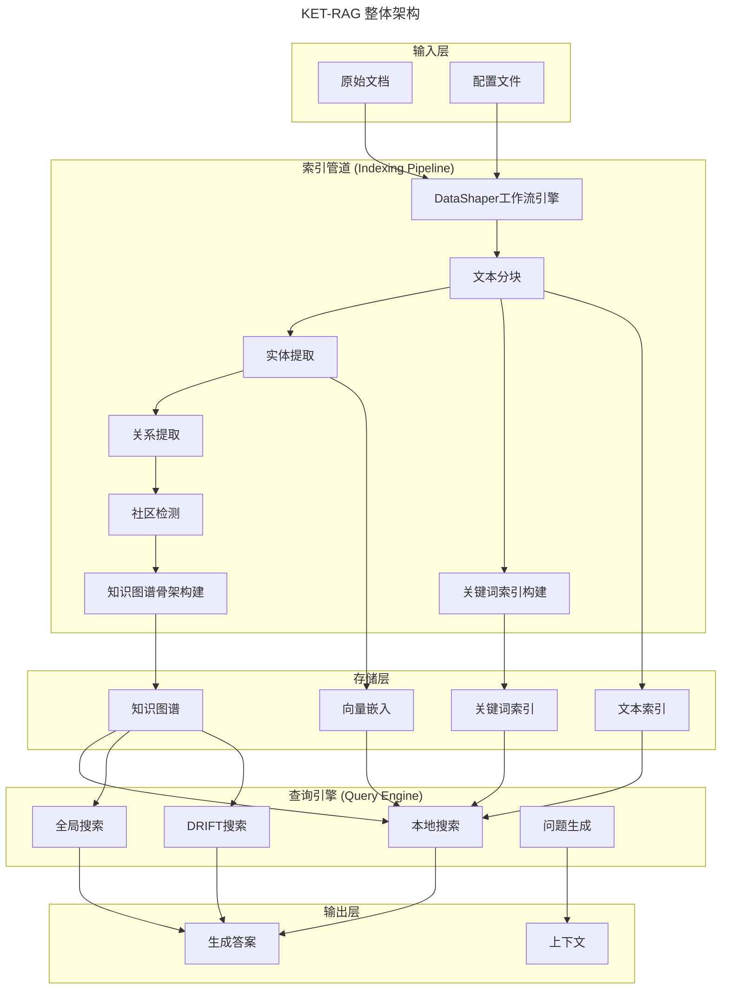
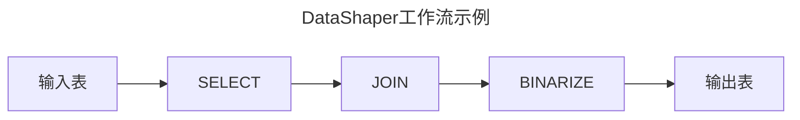
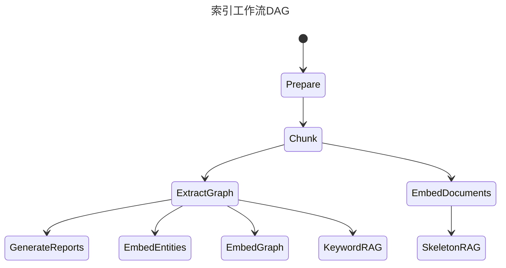

# KET-RAG 项目架构文档

## 项目概述

**KET-RAG (Knowledge-Enhanced Text Retrieval Augmented Generation)** 是一个功能强大且灵活的检索增强生成(RAG)框架，通过知识图谱增强检索能力。该项目允许结构化文档索引和高效的基于LLM的答案生成。

KET-RAG 在检索质量和效率之间取得平衡，采用多粒度索引框架，包含两个核心组件：

### 核心创新组件

1. **知识图谱骨架 (SkeletonRAG)**
   - 通过PageRank算法选择关键文本块
   - 使用LLM提取结构化知识
   - 构建高质量的知识图谱骨架

2. **文本-关键词二部图 (KeywordRAG)**
   - 将关键词链接到文本块
   - 以最小成本模拟知识图谱关系
   - 提供轻量级的检索索引

## 整体架构

KET-RAG基于Microsoft GraphRAG构建，主要包含两个核心模块：

### 1. 索引管道 (Indexing Pipeline)
负责将原始文档处理成结构化的知识表示

### 2. 查询引擎 (Query Engine) 
负责基于索引数据进行检索和答案生成



## 详细架构组件

### 一、索引管道 (Indexing Pipeline)

#### 1.1 DataShaper工作流引擎
- **基础框架**: 基于Microsoft DataShaper库构建
- **工作流模型**: 声明式数据管道表达
- **动词系统**: 使用SELECT、DROP、JOIN等关系操作动词
- **数据流**: 基于pandas.DataFrame的表格式数据传递



#### 1.2 LLM增强的工作流步骤
- **实体提取**: 使用LLM从文本中提取命名实体
- **关系提取**: 识别实体间的语义关系
- **声明提取**: 提取文档中的关键声明和断言
- **社区结构**: 检测知识图谱中的社区结构
- **社区报告**: 生成社区摘要和报告

#### 1.3 工作流依赖图 (DAG)


#### 1.4 KET-RAG特有组件

##### SkeletonRAG (知识图谱骨架)
- **目标**: 构建高质量的知识图谱骨架
- **方法**: 
  - 使用PageRank算法选择重要文本块
  - 通过LLM提取结构化知识
  - 构建实体-关系网络
- **输出**: 精炼的知识图谱结构

##### KeywordRAG (关键词索引)
- **目标**: 建立轻量级的文本-关键词映射
- **方法**:
  - 提取文档关键词
  - 构建关键词到文本块的二部图
  - 过滤停用词和标点符号
- **输出**: 关键词索引和映射关系

### 二、查询引擎 (Query Engine)

#### 2.1 本地搜索 (Local Search)
- **原理**: 结合知识图谱和原始文本块生成答案
- **适用场景**: 需要理解文档中特定实体的问题
- **示例**: "洋甘菊的治疗特性是什么？"

#### 2.2 全局搜索 (Global Search)
- **原理**: 以map-reduce方式搜索所有AI生成的社区报告
- **适用场景**: 需要理解整个数据集的问题
- **特点**: 资源密集型但答案质量高
- **示例**: "笔记中提到的草药最重要的价值是什么？"

#### 2.3 DRIFT搜索
- **创新点**: 在搜索过程中包含社区信息
- **优势**: 扩大查询起点的广度，检索更多样化的事实
- **方法**: 使用社区洞察将查询细化为详细的后续问题

#### 2.4 问题生成
- **功能**: 根据用户查询生成后续候选问题
- **应用**: 对话式跟进问题生成，深入数据集探索

### 三、存储架构

#### 3.1 存储抽象层
```python
# 支持多种存储后端
PipelineStorage
├── FilePipelineStorage      # 文件系统存储
├── BlobPipelineStorage      # 云存储(Azure Blob)
└── MemoryPipelineStorage    # 内存存储
```

#### 3.2 缓存机制
```python
# 多级缓存系统
PipelineCache
├── JsonPipelineCache        # JSON文件缓存
├── InMemoryCache           # 内存缓存
└── NoopPipelineCache       # 无缓存模式
```

#### 3.3 数据模型

##### 核心实体
- **Document**: 原始文档
- **TextUnit**: 文本块/分块
- **Entity**: 提取的实体
- **Relationship**: 实体关系
- **Community**: 社区结构
- **CommunityReport**: 社区报告
- **Covariate**: 协变量

### 四、配置系统

#### 4.1 管道配置
```yaml
# settings.yaml 示例
encoding_model: "cl100k_base"
skip_workflows: []
local_search:
  text_unit_prop: 0.5
  community_prop: 0.1
  conversation_history_max_turns: 5
global_search:
  max_tokens: 12000
  data_max_tokens: 12000
```

#### 4.2 工作流配置
- **输入配置**: CSV/文本文件输入
- **存储配置**: 文件/Blob/内存存储
- **缓存配置**: 多级缓存策略
- **报告配置**: 控制台/文件/Blob报告

### 五、KET-RAG特有流程

#### 5.1 上下文生成流程
```bash
python indexing_sket/create_context.py ragtest-musique/ keyword 0.5
```

**参数说明**:
- **第一个参数**: 项目根目录
- **第二个参数**: 上下文构建策略 (`text`, `keyword`, `skeleton`)
- **第三个参数**: 上下文阈值theta (范围: 0.0-1.0)

#### 5.2 答案生成流程
```bash
python indexing_sket/llm_answer.py ragtest-musique/
```

**功能**: 为输出目录中的所有上下文文件生成答案

### 六、技术栈

#### 6.1 核心依赖
- **Python**: >=3.10
- **DataShaper**: 数据处理管道
- **OpenAI**: LLM API接口
- **pandas**: 数据框架处理
- **numpy**: 数值计算
- **faiss**: 向量相似度搜索
- **lancedb**: 向量数据库
- **tiktoken**: 文本分词

#### 6.2 向量存储
- **Azure Search Documents**: Azure认知搜索
- **LanceDB**: 向量数据库
- **FAISS**: Facebook向量相似度搜索

### 七、部署和使用

#### 7.1 初始化项目
```bash
python -m graphrag init --root ragtest-musique/
```

#### 7.2 提示调优
```bash
python -m graphrag prompt-tune --root ragtest-musique/ --config ragtest-musique/settings.yaml --discover-entity-types
```

#### 7.3 构建索引
```bash
python -m graphrag index --root ragtest-musique/
```

### 八、性能特点

#### 8.1 KET-RAG优势
- **成本效率**: 显著降低索引成本
- **检索质量**: 提高检索和生成质量
- **可扩展性**: 适用于大规模RAG应用
- **灵活性**: 支持多种检索策略

#### 8.2 多粒度索引
- **粗粒度**: SkeletonRAG提供高质量骨架
- **细粒度**: KeywordRAG提供详细映射
- **自适应**: 根据查询类型选择最佳策略

## 总结

KET-RAG通过创新的双重索引策略(SkeletonRAG + KeywordRAG)，在保持检索质量的同时显著降低了计算成本。其基于GraphRAG的架构提供了强大的扩展性和灵活性，是大规模知识增强文本生成应用的理想选择。

该架构的核心优势在于：
1. **智能索引**: 结合知识图谱骨架和关键词映射
2. **多样化检索**: 支持本地、全局、DRIFT等多种搜索策略  
3. **高效缓存**: 多级缓存机制提高响应速度
4. **模块化设计**: 基于DataShaper的工作流架构易于扩展
5. **成本优化**: 显著降低LLM调用成本同时保证质量